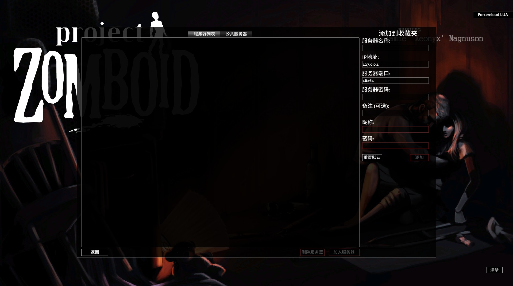

# 使用Docker搭建ProjectZomboid服务器


## 引言

在本文中，我将介绍如何使用Docker来搭建一个非Steam认证的PorjectZombodi服务器。Project Zomboid是一款非常受欢迎的僵尸生存游戏，通过搭建私人服务器，您可以和朋友们一起在这个后启示录世界中生存，而不依赖于Steam验证。让我们开始吧。


## 前提条件

- 一台运行Linux的服务器（本教程以CentOS Stream 9）
- 已安装Docker和Docker Compose

```shell
# 卸载旧版本的Docker
sudo yum remove docker \
	 docker-client \
	 docker-client-latest \
	 docker-common \
	 docker-latest-logrotate \
	 docker-logrotate \
	 docker-engine
	 
# 安装Docker依赖软件包，设置Docker的repo仓库
sudo yum install -y yum-utils devic-mapper-persistent-data lvm2
sudo yum-config-manager --add-repo http://mirrors.aliyun.com/docker-ce/linux/centos/docker-ce.repo

# 安装Docker和Docker-cli
sudo yum install -y docker-ce docker-ce-cli containerd.io docker-buildx-plugin docker-compose-plugin

# 设置Docker开机自启
sudo systemctl enable docker

# 安装Docker Compose
sudo curl -L https://github.com/docker/compose/releases/downl
oad/v2.32.4/docker-compose-darwin-x86_64 -o /usr/local/bin/docker-compose

# 赋予Docker Compose执行权限
sudo chmod +x /usr/bin/docker-compose

```


## 配置文件

```shell
# 创建文件目录
mkdir /home/docker/data/pz-server && cd /home/docker/data/pz-server

# 创建一个名为docker-compose.yml的文件
touch docker-compose.yml

# 创建环境变量文件
touch .env

# 创建一个名为pz-network的网络
docker network create pz-network
```

`.env`文件，内容如下：

```shell
# Empty Strings are ignored or equivalent to false
LANG=en_EN.UTF-8
NOSTEAM=true
ADMINUSERNAME=admin
ADMINPASSWORD=password
SERVERNAME=MY PZ Server
IP=
PORT=16261
STEAMVAC=false
MEMORY=8192m
SOFTRESET=False
MOD_IDS=
WORKSHOP_IDS=
```

`docker-compose.yml`文件，内容如下：

```shell
version: "3.8"
services:
  ProjectZomboidDedicatedServer:
    container_name: pz
    image: danixu86/project-zomboid-dedicated-server:latest
    restart: unless-stopped
    networks:
      - pz-network
    env_file:
      - .env
    ports:
      - "16261:16261/udp"
      - "16262:16262/udp"
      - "27015:27015/tcp"
    volumes:
      - ./data:/home/steam/Zomboid
      - ./custom-mods:/home/steam/Zomboid/mods

networks:
  pz-network:
    driver: bridge
```

配置文件的主要部分：

`container_name`: 设置容器的名称为pz。

`image`: 使用danixu86/project-zomboid-dedicated-server镜像

`restart`: 设置为unless-stopped，意味着除非手动停止，否则容器会自动重启。

`ports`: 映射了16261、16262两游戏的UDP端口和27015/tcp的远程控制端口。

`volumes`: 将服务器文件和配置文件映射到本地目录，以便持久化数据。

`env_file`: 加载环境变量，指定.env文件在启动服务时读取这个文件。


## 启动服务器

在包含`docker-compose.yml`文件的目录中，运行一下命令来启动服务器：

```shell
docker compose up -d
```


## 开发防火墙端口

为了确保其他玩家可以连接到服务器，需要在防火墙中开放想要的端口。以下使用`firewalld-cmd`（CentOS默认防火墙）开发端口的步骤：

```shell
sudo firewall-cmd --zone=public --add-port=16261/udp --permanent
sudo firewall-cmd --zone=public --add-port=16262/udp --permanent
sudo firewall-cmd --zone=public --add-port=27015/tcp --permanent
sudo firewall-cmd --reload
```

路由器的防火墙也需要放行对应的端口，就不作演示了。


## DNS域名解析

以下为主要步骤：

1.到各大域名提供商注册一个域名。

2.进入解析管理页面，添加一个A记录，以实现将域名指向特定IP地址。

3.注册Cloudflare账号，将注册的域名的DNS改为Cloudflare的DNS，添加一个A记录实现Cloudfalre管理


## 连接到服务器

现在，您的Project Zomboid服务器应该可以成功运行了。玩家可以通过一下步骤连接到服务器

1.启动Porject Zomboid游戏。



2.选择“加入服务器”。

3.输入服务器的IP地址和端口（填写域名地址，端口默认为16261）。

4.输入在`.env`文件中设置的服务器密码。

5.点击“加入服务器”，就可以开始游戏了。


## 管理服务器

- 查看服务器日志：

```shell
docker-compose logs -f pz
```

- 重启服务器：

```shell
docker-compose down && docker-compose up -d
```

- 重启容器：

```shell
docker restart pz
```


## 常见问题解决

如果在和朋友游玩时经常被提出服务器，遇到”检测到格式错误的数据包“等问题，可以通过关闭作弊检测来解决。注意，公开服务器不建议修改此项。

在Linux环境下，操作步骤如下：

1.进入服务器配置目录：

```shell
cd ./data/Server
```

2.将`AntiCheatProtectionType`参数1-24和Steam VAC全部修改为false

```shell
sed -i '318,383s/true/false/g' ./server.ini
sed -i 's/SteamVAC=true/SteamVAC=false' ./server.ini
```


## 安装Mods

要在服务器上安装Mods，需要在`.env`文件中添加以下内容：

```shell
MOD_IDS=Diederiks Tile Palooza;DylansTiles;EN_Flags
WORKSHOP_IDS=2337452747;2599752664;2784607980
```

- `MOD_IDS`: Mod的名称，用分号分隔。
- `WORKSHOP_IDS`: Mod的Steam Workshop ID，用分号分隔。

添加或更新Mods后，重启容器即可自动应用更改：

```shell
docker-compose down && docker-compose up -d
```


## 注意事项

- 请确保定期备份您的服务器的数据（位于./data）。
- 如果计划将服务器公开，请更改默认的管理员密码和服务器密码以及远程管理服务器的密码。
- 根据需要调整MEMORY的值来调整分配的内存。

通过以上步骤，您应该能够成功搭建并运行一个Project Zomboid非Steam服务器。祝您在这个充满挑战的僵尸世界中度过愉快的时光！如果遇到其他问题，欢迎在下面留言讨论。
